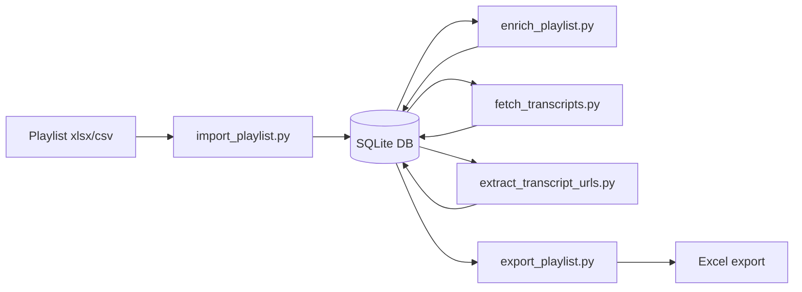

# YouTube Playlist Enricher

A Python toolkit that enriches YouTube video playlists using a **SQLite database** as the canonical store. Videos are deduplicated globally; multiple playlists can share the same videos without re-fetching metadata or transcripts.

## What it does



### Pipeline stages

1. **Import** — load a spreadsheet into the database (`import_playlist.py`)
2. **Metadata** — fetch channel info, stats, descriptions, tags (`enrich_playlist.py`)
3. **Transcripts** — fetch full captions once per video (`fetch_transcripts.py`)
4. **URL extraction** — extract websites mentioned in transcripts (`extract_transcript_urls.py`)
5. **Export** — write a playlist back to Excel/CSV (`export_playlist.py`)

Each stage skips work already completed in the database. Transcripts are downloaded **once** per video and never re-fetched unless `--force` is used.

## Prerequisites

- Python 3.10+ (tested with 3.14)
- A Google Cloud project with **YouTube Data API v3** enabled (metadata stage only)
- A YouTube Data API key in `.env` (metadata stage only)

## Project files

| File | Purpose |
|------|---------|
| `playlist_db.py` | SQLite schema, CRUD, and work-queue queries |
| `import_playlist.py` | Import spreadsheet into database |
| `export_playlist.py` | Export playlist from database to xlsx/csv |
| `enrich_playlist.py` | Stage 1 — metadata via YouTube Data API |
| `fetch_transcripts.py` | Stage 2 — transcripts via youtube-transcript-api |
| `extract_transcript_urls.py` | Stage 3 — URL extraction from transcripts |
| `playlist_utils.py` | Shared spreadsheet I/O and URL helpers |
| `pipeline_cli.py` | Shared CLI helpers (`--db`, `--playlist`, `--export`) |
| `data/playlist.db` | Default database (local only; not tracked in git) |

## Setup

```bash
cd yt-playlists
python3 -m venv .venv
source .venv/bin/activate
pip install -r requirements.txt
cp .env.example .env
# Edit .env with your YouTube API key
```

## Database model

- **`videos`** — one row per unique `video_id` (metadata, transcript, URLs)
- **`playlists`** — named playlists (e.g. `"AI-ML"`)
- **`playlist_videos`** — many-to-many links preserving row order

Importing a second playlist that shares videos only creates new links; existing transcript/metadata is reused.

## Usage

### Import a playlist

```bash
python import_playlist.py -i "AI-ML Playlist.xlsx" --name "AI-ML"
```

Re-importing is safe — videos are deduplicated by `video_id`.

### Migrate existing spreadsheet data

If you already have enriched or transcript spreadsheets from a prior run:

```bash
python import_playlist.py -i "AI-ML Playlist.xlsx" --name "AI-ML"
python import_playlist.py -i "AI-ML Playlist_Enriched.xlsx" --name "AI-ML" --migrate
python import_playlist.py -i "AI-ML Playlist_Enriched_Transcripts.xlsx" --name "AI-ML" --migrate
```

The `--migrate` flag seeds empty database fields from spreadsheet columns without overwriting existing DB data.

### Run the pipeline

```bash
python enrich_playlist.py --playlist "AI-ML"
python fetch_transcripts.py --playlist "AI-ML" --delay 3
python extract_transcript_urls.py --playlist "AI-ML"
```

Each command only processes videos that still need work.

### Export for Excel

```bash
python export_playlist.py --playlist "AI-ML" -o "AI-ML Playlist_Enriched.xlsx"
```

Or export after any pipeline stage:

```bash
python fetch_transcripts.py --playlist "AI-ML" --export "AI-ML Playlist_Enriched.xlsx"
```

### Import a second playlist

```bash
python import_playlist.py -i "Other Playlist.xlsx" --name "Other"
python fetch_transcripts.py --playlist "Other" --delay 3
```

Only videos not already in the database are fetched.

## CLI reference

### Shared flags (pipeline scripts)

| Flag | Description |
|------|-------------|
| `--db` | SQLite path (default: `data/playlist.db` or `PLAYLIST_DB` env var) |
| `--playlist`, `-p` | Playlist name in the database (required) |
| `--export`, `-o` | Export playlist to xlsx/csv after the run |
| `--force`, `-f` | Re-process completed items (where applicable) |

### import_playlist.py

| Flag | Description |
|------|-------------|
| `--input`, `-i` | Input spreadsheet (required) |
| `--name`, `-n` | Playlist name (default: filename stem) |
| `--migrate` | Seed DB from existing spreadsheet columns |

### fetch_transcripts.py extras

| Flag | Description |
|------|-------------|
| `--delay` | Seconds between requests (default: `2.5`) |
| `--max-videos` | Limit videos fetched per run |
| `--continue-on-ip-block` | Don't stop early on IP rate limits |

## Skip / fetch rules

### Transcripts

| Status | Next run |
|--------|----------|
| `ok` with transcript text | Skip (downloaded once) |
| `no_captions` | Skip permanently |
| `unavailable` | Skip permanently |
| `ip_blocked`, `error`, or not attempted | Fetch |
| `--force` | Re-fetch videos previously `ok` |

### Metadata

Skip when `channel_name` is populated. Re-fetch with `--force`.

### URL extraction

Skip when `transcript_urls` is populated for videos with `ok` transcripts.

## Output columns (export)

Same columns as before: `Video Title`, `Video URL`, metadata columns, `Full Video Transcript`, `Transcript Language`, `Transcript Status`, `URLs from Transcript (comma-separated)`, `All URLs (description + transcript)`.

## Transcript limitations

- Fetched via unofficial `youtube-transcript-api` (no API key)
- Only videos with captions return transcript text
- IP rate limiting may occur — use `--delay 3`, batch with `--max-videos 30`, and re-run to resume
- Progress is stored in the database automatically after each video

## Example workflow

```bash
# First-time setup
pip install -r requirements.txt
cp .env.example .env

# Import and run pipeline
python import_playlist.py -i "AI-ML Playlist.xlsx" --name "AI-ML"
python enrich_playlist.py --playlist "AI-ML"
python fetch_transcripts.py --playlist "AI-ML" --delay 3
python extract_transcript_urls.py --playlist "AI-ML"
python export_playlist.py --playlist "AI-ML" -o "AI-ML Playlist_Enriched.xlsx"

# Resume after IP block (skips completed videos automatically)
python fetch_transcripts.py --playlist "AI-ML" --delay 3

# Add another playlist
python import_playlist.py -i "Other Playlist.xlsx" --name "Other"
python fetch_transcripts.py --playlist "Other" --delay 3
```

## Troubleshooting

### `Playlist not found in database`

Run `import_playlist.py` first.

### `Missing API key`

Only metadata enrichment needs `YOUTUBE_API_KEY` in `.env`.

### IP rate limits during transcript fetch

Wait 30–60 minutes, then re-run. The database resumes from where it stopped.

### `Transcript Status = ip_blocked`

Transient. Re-run `fetch_transcripts.py` later; completed videos are skipped.

## Security

- Never commit `.env` or share your API key
- `.gitignore` excludes `.env`, `data/`, `*.db`, and `*.xlsx`
