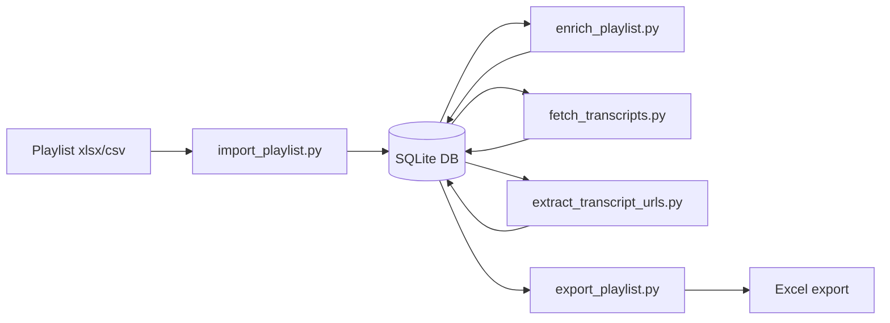

# YouTube Playlist Enricher

A Python toolkit that enriches YouTube video playlists using a **SQLite database** as the canonical store. Videos are deduplicated globally; multiple playlists can share the same videos without re-fetching metadata or transcripts.

## What it does



### Pipeline stages

1. **Import** — load a spreadsheet into the database (`import_playlist.py`)
2. **Metadata** — fetch channel info, stats, descriptions, tags (`enrich_playlist.py`)
3. **Transcripts** — fetch full captions once per video (`fetch_transcripts.py`)
4. **URL extraction** — extract websites mentioned in transcripts (`extract_transcript_urls.py`)
5. **Export** — write a playlist back to Excel/CSV (`export_playlist.py`)

Each stage skips work already completed in the database. Transcripts are downloaded **once** per video and never re-fetched unless `--force` is used.

## Prerequisites

- Python 3.10+ (tested with 3.14)
- A Google Cloud project with **YouTube Data API v3** enabled (metadata stage only)
- A YouTube Data API key in `.env` (metadata stage only)

## Project files

| File | Purpose |
|------|---------|
| `playlist_db.py` | SQLite schema, CRUD, and work-queue queries |
| `import_playlist.py` | Import spreadsheet into database |
| `export_playlist.py` | Export playlist from database to xlsx/csv |
| `enrich_playlist.py` | Metadata via YouTube Data API |
| `fetch_transcripts.py` | Transcripts via youtube-transcript-api |
| `extract_transcript_urls.py` | URL extraction from transcripts |
| `playlist_utils.py` | Shared spreadsheet I/O and URL helpers |
| `pipeline_cli.py` | Shared CLI helpers (`--db`, `--playlist`, `--export`) |
| `data/playlist.db` | Default database (local only; not tracked in git) |

## Setup

```bash
cd yt-playlists
python3 -m venv .venv
source .venv/bin/activate
pip install -r requirements.txt
cp .env.example .env
# Edit .env with your YouTube API key
```

## Database model

- **`videos`** — one row per unique `video_id` (metadata, transcript, URLs)
- **`playlists`** — named playlists (e.g. `"AI-ML"`)
- **`playlist_videos`** — many-to-many links preserving row order

Importing a second playlist that shares videos only creates new links; existing transcript/metadata is reused.

## Usage

### Import a playlist

```bash
python import_playlist.py -i "AI-ML Playlist.xlsx" --name "AI-ML"
```

Re-importing is safe — videos are deduplicated by `video_id`.

### Migrate existing spreadsheet data

If you already have enriched or transcript spreadsheets from a prior run:

```bash
python import_playlist.py -i "AI-ML Playlist.xlsx" --name "AI-ML"
python import_playlist.py -i "AI-ML Playlist_Enriched.xlsx" --name "AI-ML" --migrate
python import_playlist.py -i "AI-ML Playlist_Enriched_Transcripts.xlsx" --name "AI-ML" --migrate
```

The `--migrate` flag seeds empty database fields from spreadsheet columns without overwriting existing DB data.

### Run the pipeline

```bash
python enrich_playlist.py --playlist "AI-ML"
python fetch_transcripts.py --playlist "AI-ML" --delay 3
python extract_transcript_urls.py --playlist "AI-ML"
```

Each command only processes videos that still need work.

### Export for Excel

```bash
python export_playlist.py --playlist "AI-ML" -o "AI-ML Playlist_Enriched.xlsx"
```

Or export after any pipeline stage:

```bash
python fetch_transcripts.py --playlist "AI-ML" --export "AI-ML Playlist_Enriched.xlsx"
```

### Import a second playlist

```bash
python import_playlist.py -i "Other Playlist.xlsx" --name "Other"
python fetch_transcripts.py --playlist "Other" --delay 3
```

Only videos not already in the database are fetched.

## CLI reference

### Shared flags (pipeline scripts)

| Flag | Description |
|------|-------------|
| `--db` | SQLite path (default: `data/playlist.db` or `PLAYLIST_DB` env var) |
| `--playlist`, `-p` | Playlist name in the database (required) |
| `--export`, `-o` | Export playlist to xlsx/csv after the run |
| `--force`, `-f` | Re-process completed items (where applicable) |

### import_playlist.py

| Flag | Description |
|------|-------------|
| `--input`, `-i` | Input spreadsheet (required) |
| `--name`, `-n` | Playlist name (default: filename stem) |
| `--migrate` | Seed DB from existing spreadsheet columns |

### fetch_transcripts.py extras

| Flag | Description |
|------|-------------|
| `--delay` | Seconds between successful requests (default: `2.5`) |
| `--max-videos` | Limit videos fetched per run (default: no limit) |
| `--language`, `-l` | Preferred transcript languages, comma-separated (default: `en,en-US,en-GB`) |
| `--initial-ip-backoff` | Starting IP backoff delay in seconds (default: `30`) |
| `--max-ip-backoff` | Maximum IP backoff delay in seconds (default: `1800` = 30 minutes) |

### extract_transcript_urls.py extras

| Flag | Description |
|------|-------------|
| `--exclude-youtube` | Omit youtube.com and youtu.be links from extracted URLs |

### export_playlist.py

| Flag | Description |
|------|-------------|
| `--output`, `-o` | Output file path (required; `.xlsx` or `.csv`) |
| `--db` | SQLite path (default: `data/playlist.db` or `PLAYLIST_DB` env var) |

## Skip / fetch rules

### Transcripts

| Status | Next run |
|--------|----------|
| `ok` with transcript text | Skip (downloaded once) |
| `no_captions` | Skip permanently |
| `unavailable` | Skip permanently |
| `ip_blocked`, `error`, or not attempted | Fetch (retried until resolved) |
| `--force` | Re-fetch videos previously `ok` |

`error` is **not** permanent — unexpected network failures during a rate-limit wait can mark a video `error` and move on, but the work queue picks it up again in the same run or on restart. The current script does not write `ip_blocked` during rate limits (that status is only from older runs).

### Metadata

Skip when `channel_name` is populated. Re-fetch with `--force`.

### URL extraction

Skip when `transcript_urls` is populated for videos with `ok` transcripts.

## Output columns (export)

Exports use these columns (in order):

- `Video Title`, `Video URL`
- `Channel Name`, `Channel ID`, `Publish Date`, `Video Length`, `View Count`, `Like Count`, `Comment Count`
- `Full Video Description`, `Tags/Keywords`
- `All websites links and URLs listed in the description or other video meta data (comma-separated)`
- `Full Video Transcript`, `Transcript Language`, `Transcript Status`
- `URLs from Transcript (comma-separated)`, `All URLs (description + transcript)`

CSV exports are tab-delimited with quoted fields (Excel-friendly). CSV imports auto-detect comma or tab delimiters.

## Transcript limitations

- Fetched via unofficial `youtube-transcript-api` (no API key)
- Only videos with captions return transcript text
- IP rate limiting may occur — the script retries the same video with exponential backoff (30s → … → 30 minutes) until it succeeds or hits a non-rate-limit failure
- For overnight runs, use `--delay 3` (or higher) and leave the process running; progress is saved to the database after each video
- The outer work-queue loop keeps going until every video is `ok`, `no_captions`, or `unavailable` — including automatic retries of `error` rows

## Example workflow

```bash
# First-time setup
pip install -r requirements.txt
cp .env.example .env

# Import and run pipeline
python import_playlist.py -i "AI-ML Playlist.xlsx" --name "AI-ML"
python enrich_playlist.py --playlist "AI-ML"
python fetch_transcripts.py --playlist "AI-ML" --delay 3
python extract_transcript_urls.py --playlist "AI-ML"
python export_playlist.py --playlist "AI-ML" -o "AI-ML Playlist_Enriched.xlsx"

# Resume only if the process was stopped (skips completed videos automatically)
python fetch_transcripts.py --playlist "AI-ML" --delay 3

# Add another playlist
python import_playlist.py -i "Other Playlist.xlsx" --name "Other"
python fetch_transcripts.py --playlist "Other" --delay 3
```

## Troubleshooting

### `Playlist not found in database`

Run `import_playlist.py` first.

### `Missing API key`

Only metadata enrichment needs `YOUTUBE_API_KEY` in `.env`.

### IP rate limits during transcript fetch

The script does **not** exit on rate limits. It waits and retries the same video with exponential backoff (30s → 60s → ... up to 30 minutes), then keeps going until every video is `ok`, `no_captions`, or `unavailable`.

For an overnight run:

```bash
python fetch_transcripts.py --playlist "AI-ML" --delay 3
```

In another terminal, keep the Mac awake:

```bash
caffeinate -dims
```

### `Transcript Status = ip_blocked`

Legacy status from older script versions. The current fetcher waits inline on rate limits and does not write `ip_blocked`. Rows with this status are still retried. Re-run only if the process was killed; completed videos are skipped.

### `Transcript Status = error`

Usually a transient network failure (e.g. connection dropped during a long rate-limit wait). These videos are retried automatically — no manual cleanup needed unless errors persist across many passes.

## Security

- Never commit `.env` or share your API key
- `.gitignore` excludes `.env`, `data/`, `*.db`, and `*.xlsx`

## Potential Improvements

Ranked highest to lowest expected benefit for this project's main use case: reliable overnight batch processing of large playlists.

1. **Retry network errors during IP backoff waits** *(fix)* — `ConnectionError` and similar failures during a rate-limit retry loop currently mark a video `error` and move on. Treat these like transient errors (retry with backoff, don't advance) so overnight runs need fewer passes. Observed in production logs during long 8–16 minute waits.

2. **`status` command** *(UX)* — Add `python status_playlist.py --playlist "AI-ML"` (or similar) that prints pipeline counts (`metadata_done`, `transcript_ok`, `pending`, `error`, etc.) without opening SQLite or tailing terminal output. High value for checking progress while a fetch runs or after waking up.

3. **Unified pipeline runner** *(feature)* — Single entry point, e.g. `python run_pipeline.py --playlist "AI-ML" --stages metadata,transcripts,urls`, that chains stages in order and stops on unrecoverable errors. Reduces manual command sequencing and copy-paste mistakes.

4. **Proxy support for transcript fetch** *(feature)* — Expose `youtube-transcript-api` proxy configuration via CLI (`--proxy` or env var). Could reduce IP blocks on long runs without changing the overall architecture.

5. **Mark API-missing videos as unavailable in metadata stage** *(fix)* — Videos deleted/private/not returned by the YouTube Data API stay in the metadata work queue forever (`channel_name` never populated). Record them as `unavailable` (or a dedicated status) so later stages don't waste time on them.

6. **File logging for long runs** *(UX)* — Add `--log-file fetch.log` (or always log to `data/logs/`) alongside stdout. Terminal scrollback is easy to lose on overnight runs; a log file makes post-mortems and progress checks much easier.

7. **Tests for work-queue and skip rules** *(quality)* — Unit tests for `playlist_db.py` queries (`get_videos_needing_*`), migrate/seed behavior, and transcript status transitions. No tests exist today; these are the highest-risk areas for silent regressions.

8. **Prioritize `error` rows in transcript queue** *(fix)* — When refreshing the work queue, process `error` (and legacy `ip_blocked`) videos before untouched rows so transient failures from the current run get another chance sooner.

9. **GitHub Actions CI** *(CI/CD)* — Lint (`ruff`) and run tests on push/PR. Low effort once tests exist; catches breakage before it affects a multi-hour fetch.

10. **Pin dependency versions** *(CI/CD / reliability)* — `requirements.txt` uses unpinned packages. Pin versions (or add a lock file) so a fresh `pip install` months later doesn't pull breaking API changes.

11. **Graceful shutdown on SIGINT/SIGTERM** *(UX / fix)* — Catch signals, finish the current video write, print summary, and exit cleanly. Avoids wondering whether the last in-flight upsert completed when stopping a long run.

12. **Makefile or task runner** *(UX)* — Short aliases for common flows (`make import`, `make fetch`, `make status`, `make export`). Small convenience win for repeated personal use.

13. **Pre-commit hooks** *(CI/CD)* — `ruff format` + `ruff check` on commit. Keeps style consistent as the script count grows.

14. **`--dry-run` mode** *(UX)* — Print how many videos each stage would process without calling external APIs. Useful before starting a long run or after a migration.

15. **Optional web dashboard** *(feature)* — Read-only local UI over the SQLite DB for browsing playlist progress, errors, and exports. Nice-to-have for a personal CLI tool; lower priority than status CLI and logging.

16. **Batch export of all playlists** *(feature)* — `export_all_playlists.py` or `--all` flag to dump every playlist in one command. Only matters once multiple playlists are in regular use.
